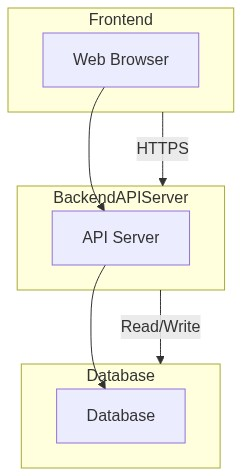

# High-Level Architecture Document: Affirmation Tracker

## 1. Introduction

The Affirmation Tracker is a tool designed to assist users in cultivating a positive mindset by allowing them to record, categorize, and track daily affirmations. This tool addresses the need for a structured system to maintain a consistent affirmation practice, thereby enhancing mental well-being and productivity. The architecture outlined in this document supports the functional and non-functional requirements specified in the Product Requirements Document (PRD).

## 2. Architecture Diagram

Below is a high-level architecture diagram illustrating the main components of the Affirmation Tracker system and their interactions.

## 3. Component Descriptions

### Frontend

- **Web Browser**: The frontend component is accessed via a web browser. It provides the user interface for entering, categorizing, and tracking affirmations. It also supports voice-to-text inputs and displays notifications for reminders. The frontend communicates with the backend API server over HTTPS for secure data transmission.

### Backend API Server

- **API Server**: The backend API server handles requests from the frontend. It processes user inputs, manages authentication and authorization, and interacts with the database to store and retrieve affirmation data. The server implements business logic for categorization, history tracking, and reminder notifications.

### Database

- **Database**: The database is responsible for storing user affirmation data, categories, timestamps, and user preferences securely. It ensures data integrity and supports queries for history tracking and progress visualization. Data is encrypted both in transit and at rest to meet security requirements.

## 4. Data Flow

1. **User Input**: Users enter affirmations through a web interface, selecting categories and using voice-to-text features if desired.
2. **Request Handling**: The frontend sends HTTPS requests to the backend API server with the affirmation data, including category tags and timestamps.
3. **Data Processing**: The API server processes incoming requests, applies business logic, and interacts with the database for storing or retrieving data.
4. **Database Operations**: The database stores affirmation entries, user preferences, and historical data. It retrieves data for user history viewing and progress tracking.
5. **Response**: The API server sends responses back to the frontend, confirming successful operations or providing requested data.
6. **User Interface Update**: The frontend updates the user interface with confirmation messages, retrieved affirmation history, or progress visualizations.

This architecture ensures a seamless user experience, supporting the application's goals and KPIs as outlined in the PRD. The system is scalable and secure, accommodating up to 1000 concurrent users while ensuring data privacy and accessibility.